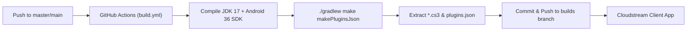

# CI/CD & Deployment Workflow

This project utilizes GitHub Actions for automated continuous integration, building plugin artifacts, and deploying them to a dedicated `builds` branch.

---

## 1. Overview



---

## 2. GitHub Actions Workflow Configuration

The workflow is defined at [`.github/workflows/build.yml`](file:///media/zihad/data/Projects/cloudstream/.github/workflows/build.yml).

### 2.1. Trigger Conditions
- **Push Events:** Triggers on pushes to `master` and `main` branches.
- **Path Filter:** Changes affecting only markdown files (`*.md`) are ignored to prevent redundant builds.
- **Manual Trigger:** Can be manually dispatched via `workflow_dispatch` in the GitHub Actions tab.

### 2.2. Concurrency
```yaml
concurrency:
  group: build-${{ github.ref }}
  cancel-in-progress: true
```
Ensures that multiple rapid pushes cancel in-flight jobs and only build the latest commit.

---

## 3. Branching Strategy

The repository follows a two-branch architecture:

| Branch | Purpose | Contents |
|---|---|---|
| `master` | Source code repository | Kotlin source files, gradle build scripts, docs |
| `builds` | Distribution branch | Compiled `.cs3` binaries and `plugins.json` manifest |

---

## 4. Repository Manifest (`repo.json`)

Cloudstream clients subscribe to plugin repositories using `repo.json`:

```json
{
    "name": "Tazihad's BDIX Repo",
    "iconUrl": "https://avatars.githubusercontent.com/u/69155993?v=4",
    "description": "Local BDIX FTP plugins for Cloudstream",
    "manifestVersion": 1,
    "pluginLists": [
      "https://raw.githubusercontent.com/tazihad/cloudstream/builds/plugins.json"
    ]
}
```

When users add the repository link:
`https://raw.githubusercontent.com/tazihad/cloudstream/master/repo.json`
The client fetches `repo.json`, which points directly to `plugins.json` on the `builds` branch.

---

## 5. Release Checklist

When adding a feature or bugfix to a plugin:

1. [ ] Implement the changes in Kotlin source code.
2. [ ] Increment `version` integer in the plugin's `build.gradle.kts`.
3. [ ] If adding new servers or user-facing changes, update [`README.md`](file:///media/zihad/data/Projects/cloudstream/README.md).
4. [ ] Commit and push to `master`:
   ```bash
   git add <modified-files>
   git commit -m "feat(PluginName): description of changes"
   git push origin master
   ```
5. [ ] Monitor the GitHub Actions tab until the build job completes successfully.
